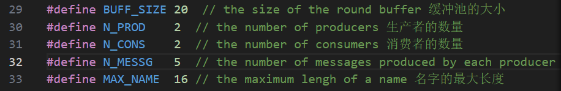
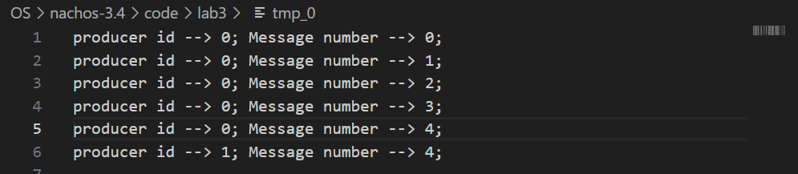
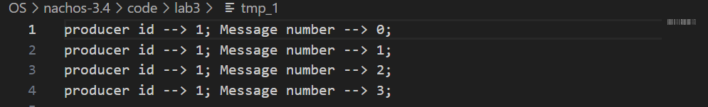

# 重要信息简述
推荐读指南，这里只是简述，直接看可能看不懂  
lab3要实现生产者-消费者问题  
main.cc不需要修改  
producer生产的是message  
补充：我看完指南的描述后便开始动手写代码了，我写到一半突然发现，指南给出了部分代码实现，建议先往后看看指南，别急着改代码。
# 问题1
问题描述：指南表示:ring.cc和ring.h不需要修改，但是我通过阅读ring.cc发现两个"to be implemented(待实现)"的函数……，算是一个矛盾点，我觉得需要改  
ring.cc中的Ring的Full()和Empty()均未实现，我决定先把它实现了:  
int Ring::Empty(){return in == out;}  
int Ring::Full(){return out == (in + 1) % size;}  
补充：阅读代码发现，这两个函数压根没用到，不实现也行。
# 线程操作：  
Thread *t = new Thread("forked thread");//创造一个线程  
t->Fork(func, arg);//让线程t去执行函数，后边为参数  
t->setStatus(state)// 设置线程状态：JUST_CREATED, RUNNING, READY, BLOCKED
Sleep();// 将线程置于睡眠状态并放弃处理器  
currentThread->Yield();// 当前线程进行让步，换一个线程继续执行  
t->Finish();// 线程t完成执行
# Ring缓冲池
slot* message = new slot(Tid,num);  
Ring* ring = new Ring(size);// 创造一个大小为size的缓冲池  
ring->Put(message);// 将message放入缓冲池  
ring->Get(message);// 取出一个message  
ring->Empty();// 判空  
ring->Full();// 判满
# 信号量：
Semaphore* sem;  
sem = new Semaphore(debugName,initialValue);// 参数为名字和初始值  
sem->getName();  
sem->P();  
sem->V();  
# 问题2：
## 问题2.1：
问题描述：目前采用 FCFS 调度算法，发现：  
producers生产的所有messages都被consumer[0]接收，consumer[1]未接收到任何message，于是请问，能不能改用RR调度算法  
解决方案(来自指南)：可在运行Nachos 时利用参数-rs 创建一个定时器设备(Timer)，如nachos -rs 5，以实现抢先式的时间片轮转线程调度算法（RR），实现生产者线程与消费者线程之间的分时操作；  
如果只想做到这里的话，那么你可以直接找我的lab3文件夹的prodcons++_v1.cc作为prodcons++.cc了
## 问题2.2：
但是指南最后有一句“思考：如何将FCFS修改成RR？”，我觉得它的意思应该让我们在代码层面实现RR，比如producers[0]生产2个message后就换producers[1]，  
我利用枚举，并写了#define SA RR来选择调度策略，并定义了RR_(这三行在prodcons++.cc代码中开头紧邻，很容易找到)  
RR_：生产者/消费者 每 生产/消费 RR_个message，就切换线程  
我在Producer()和Consumer()处进行了少量修改，得到了RR调度算法的代码实现，作为prodcons++_v2.cc
### 验证
我设置如下  
  
理论上，会按照如下执行顺序：  
p0-p1-c0-c1-p0-p1-c0-c1-p0-p1-c0  
c0会消耗p0的12345，p1的0  
c1会消耗p1的1234  
结果如下，证明代码有效：  
  

# 互斥锁(本实验用不到)：
Lock * lock= new Lock("lock");// 互斥锁的创建  
lock->Acquire();// 获得锁  
lock->Release();// 释放锁  
lock->isHeldByCurrentThread();// 如果当前线程持有此锁，则为True。
# 条件变量(本实验用不到)：
Condition *con = new Condition("con");// 条件变量创建  
con->Wait(lock);// 发现锁被占用，进入等待队列  
con->Signal(lock);// 通知等待该锁的一个线程继续执行  
con->Broadcast(lock);// 通知等待该锁的所有线程继续执行

