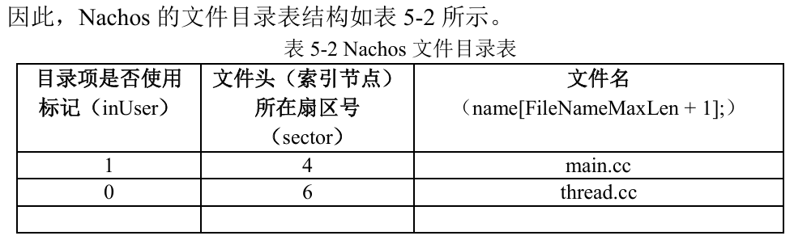

# 记录1
Nachos 模拟了一个硬盘../filesys/DISK  
# 记录2
Nachos 的文件系统依据 宏 FILESYS_STUB 与 FILESYS 条件编译产生两个不同的实现（参见../filesys/filesys.h）；  
宏FILESYS_STUB：直接利用UNIX所提供的系统调用实现(操作非DISK的文件)  
宏FILESYS：通过OpenFile类对DISK上的文件进行操作  
实验4与5默认是使用 宏 FILESYS 所定义的代码实现Nachos文件操作
# 记录3
主要设计的代码文件

# 任务(1)
任务：（1）../lab5/main.cc 调用了../threads/system.cc 中的 Initialize()创建了硬盘 DISK。分析../threads/ synchdisk.cc 及../machine/disk.cc，理解 Nachos 创建硬盘的过程与方法；
## 任务(1)-问题1：../lab5/mian.cc中：
extern void NAppend(char *nachosFile, char *nachosFile);  
参数重名，我改为了：  
extern void NAppend(char *nachosFile1, char *nachosFile2);  
# 心理活动1
我看这一堆任务觉得无从下手，并且根据前两章的经验，这个指南很可能在后边的内容中解决了这些任务，所以我决定先跟着5.3进行操作，暂停研究任务1  
# 记录4
文件系统的Nachos系统除了使用code/ filesys目录下的C++文
件外，还使用了code/threads 以及 code/userprog 目录下的 C++文件。
# 记录5
在目录code/threads、code/filesys、code/userprog 及目录 code/monitor 所对应的终端运行make命令所编译生成功能的Nachos系统功能也有所不同。  
理论上讲，  
对于 lab1 与 lab2，可在 code/threads 下完成；  
对于 lab3，可在code/monitor 下完成；  
对于 lab4 与 lab5，可在 code/ filesys 下完成；  
对于 lab6、lab7 与 lab8，可在code/ userprog 下完成。  
补充1：记录5上述内容摘自指南，我觉得对于做实验有一个思路指导，但是我的lab3是在lab3文件夹底下完成的，目前不知道跟code/monitor有什么关系，所以记录5仅供参考  
补充2：lab3底下的文件和code/monitor是一样的，lab3文件夹是code/monitor的一个拷贝，所以记录5没问题。  
# 记录6：5.4 Nachos的硬盘及文件系统具有以下特点
(1)Nachos 模拟硬盘 DISK 包括有 32 个道（NumTracks），每个道有 32 个扇区（SectorsPerTrack），每个扇区有 128 字节（SectorSize），因此磁盘大容量为  
NumTracks * SectorsPerTrack * SectorSize = 32 * 32 * 128 = 2^17B = 128KB 。（ 参见../machine/disk.h）。  
(2)DISK硬盘有1024个盘块，每个盘块仅包含一个扇区，即一个盘块大小是128字节。  
(3)磁盘开始的4个字节（0~3号字节）是硬盘标识（MagicNumber），其值为0x456789ab，指明该硬盘上的系统是由Nachos文件系统，按照Nachos文件系统对硬盘进行布局；  
(4)硬盘的第4~131号字节为硬盘的0号扇区，其后的128个字节为1号扇区，以此类推，如下图所示  
  
思考1：为什么将空闲块管理的位示图文件头，与目录表文件头存放在0号与1号这两个特殊的扇区中？  
(5)一个文件由“文件头+数据块组成”  
  
Nachos文件最大为30*128字节=3KB  
(6)采用一级目录结构（单级目录结构），Nachos的根目录中只有10个目录项，意味着Nachos的硬盘中最多可创建10个文件。有精力的同学可将其扩展成多级目录结构  
补充1：我没明白为什么根目录只有10个目录项，这里我们暂且理解为，Nachos指定了只有10个目录项，而非不能有更多目录项  
补充2：后文指南提到，每个目录项有20个字节
(7)目录表与目录项  
  
  
当访问一个文件时，根据文件名查找目录表，找到该文件文件头所在的扇区号，文件头中包含了文件大小、文件数据所占用的块数以及为文件数据所分配的盘块号。  
当删除一个文件时，只是将该文件对应的目录项中的inUser标记位清0，其余两项并没有清除，便于文件的恢复。  
(8)硬盘空闲块的管理  
数据块存放位示图数据；共128B=1024b，刚好每一位对应一个扇区  
扇区空闲则对应位为0，反之为1  
(9)当文件创建后，其大小不能改变；  
例如当复制一个文件到 Nachos 的硬盘DISK 中，该文件大小将无法改变。  
课设的任务之一就是完善Nachos的文件系统，允许文件扩展。
临时想法：当我们扩展文件时，需要改动的地方有：2号扇区的位示图文件数据块、该文件的文件头  
(10)综上所述，Nachos文件系统在硬盘DISK(更详细版)的布局如下：

# 记录7：5.5 Nachos 的文件系统命令
注：可选参数[-d f]的作用是打印出所有与文件系统有关的调试信息。  
1、./nachos [-d f] -f：格式化 Nachos 模拟的硬盘 DISK，在使用其它文件系统命令之前需要将该硬盘格式化；  
2、./nachos [-d f] -cp UNIX_filename nachos_filename：将一个 Unix 文件系统中的文件UNIX_filename 复制到Nachos文件系统中，重新命名为nachos_filename；  
补充：目前实现的Nachos 文件系统尚未提供creat()系统调用（实验 6、7、8 中实现），也就没有提供创建文件的命令。如果要在Nachos 的硬盘中创建文件，目前只能通过该命令从你的UNIX系统中复制一个文件到Nachos硬盘中；  
3、./nachos [-d f] -p nachos_filename：该命令输出 nachos 文件 nachos_filename 的内容；  
4、./nachos [-d f] -r nachos_filename：删除 Nachos 文件 nachos_filename；  
5、./nachos [-d f] -l：输出当前目录中的文件名（类似于DOS中的dir，UNIX中的ls）；  
6、./nachos [-d f] -t：测试 Nachos 文件系统的性能（目前尚未实现）;  
补充：已实现，向下找问题1  
7、./nachos [-d f] -D：输出 Nachos 的文件系统在磁盘上的组织。打印出整个文件系统的所有内容，包括位图文件（bitmap）、文件头（file header）、目录文件（directory）和普通文件（file）
# 心理活动2
如果想读懂整个Nachos磁盘的话，5.6和5.7真心建议仔细看一下
# 问题1:实现./nachos [-d f] -t
这个东西很难搞很难搞，如果你想看我解决这个问题的详细过程，阅读我实验4的实验报告的任务2，如果你想直接解决这个问题，那么在fstest.cc文件中做如下修改：  
#define FileSize 	((int)(ContentSize * 5000))改为  
#define FileSize 	((int)(ContentSize * 50))  
以及
if (!fileSystem->Create(FileName, 0))改为  
if (!fileSystem->Create(FileName, FileSize))